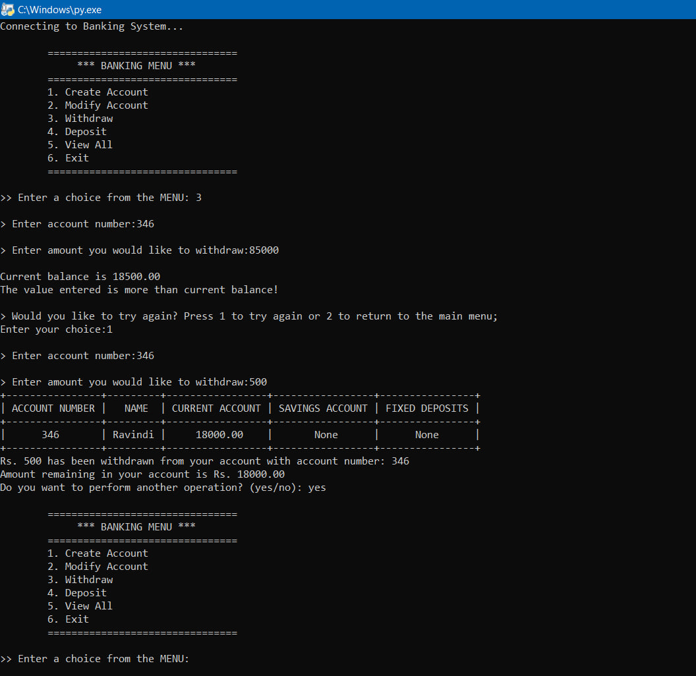
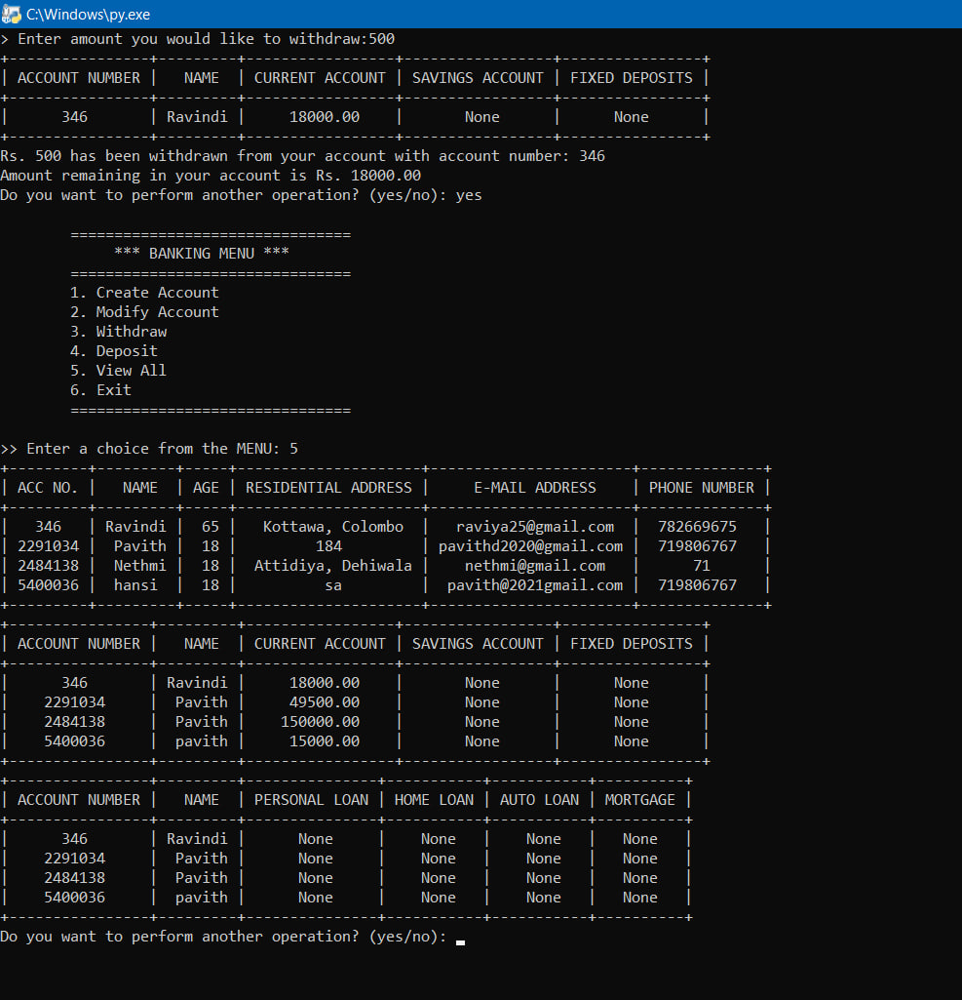
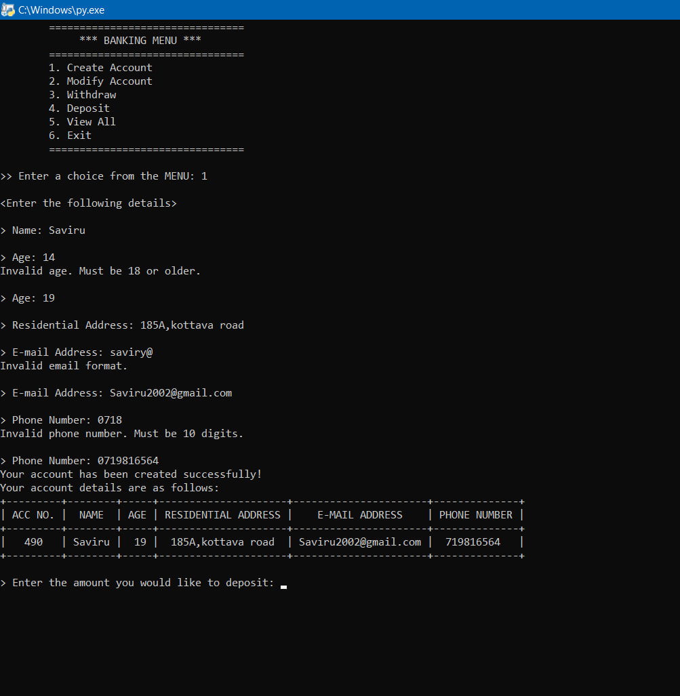

# 🏦 Python Banking System

## 🌟 Overview
A comprehensive banking system application built with Python and MySQL, providing core banking functionalities.

## ✨ Features
- 📝 Account Creation
- 🔧 Account Modification
- 💸 Withdrawal
- 💰 Deposit (Current, Savings, Fixed Deposit)
- 👀 View Account Details
- ✅ Input Validation
- 🛡️ Error Handling

## 📋 Screenshots
  

## 🔧 Prerequisites
- Python 3.8+
- MySQL
- Libraries:
  ```
  pip install mysql-connector-python prettytable
  ```

## 💾 Database Setup
1. Create MySQL database `banking_system`
2. Execute database schema (see README for full schema)

## ⚙️ Configuration
Update database connection details in script:
```python
mydb = M.connect(
    host="localhost", 
    user="root", 
    password="YOUR_PASSWORD", 
    database="banking_system"
)
```

## 🔒 Data Validations
- Name: Letters and spaces, 2+ characters
- Email: Standard email format
- Age: 18 years or older
- Phone: 10-digit number
- Minimum Account Balance: ₹10,000

## 🚀 Usage
Run the script:
```
python banking_system.py
```

## 📄 License
MIT License

